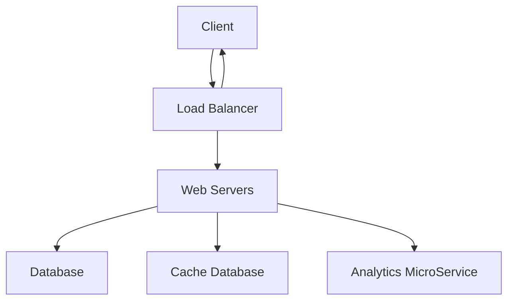

# url-shortener

## System Design URL Shortener in Golang

Client: Users accessing the web application.
Load Balancer: Distributes incoming traffic across multiple web servers.
Web Servers: Serve the web content and handle client requests.
Analytics MicroService: Collects and analyzes data from the web servers.
Database: Stores the application's data.
Cache Database: Stores frequently accessed data for faster retrieval.

The Client sends a request to the Load Balancer.

The Load Balancer distributes the request to one of the Web Servers.

The Web Servers process the request, which may involve reading from or writing to the Database.

The Web Servers can also read from or write to the Cache Database to improve performance.

The Web Servers send relevant data to the Analytics MicroService for analysis.

The Web Servers return the response to the Client via the Load Balancer.

## Entities

### URL

ID - int

original url - string

shortened url - string

## Database

### MongoDB

Set "short" as an index to find document more optimized and faster.
